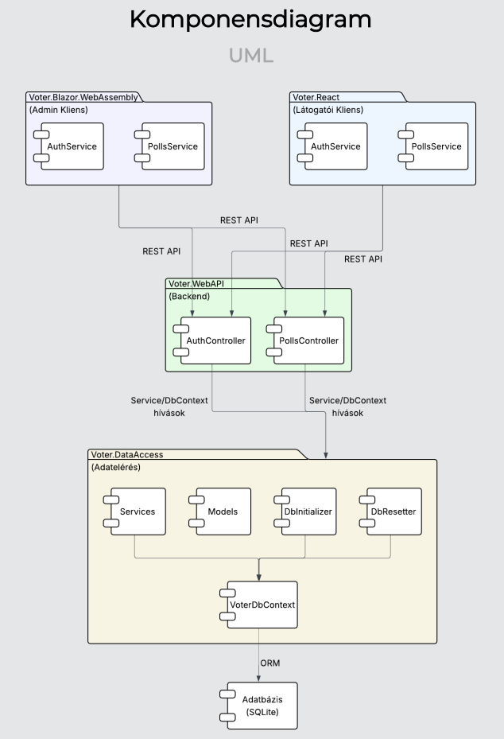
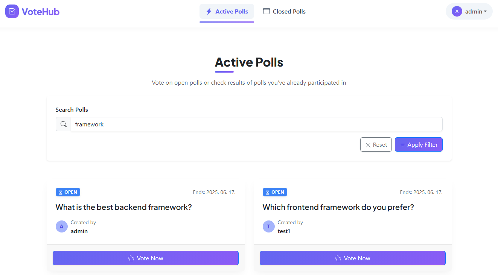
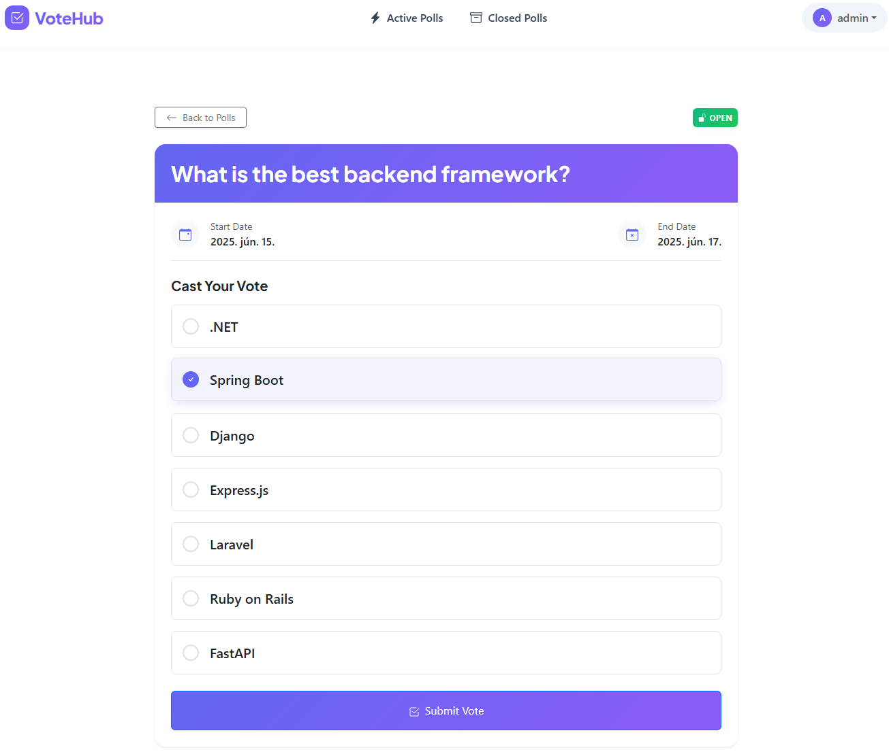
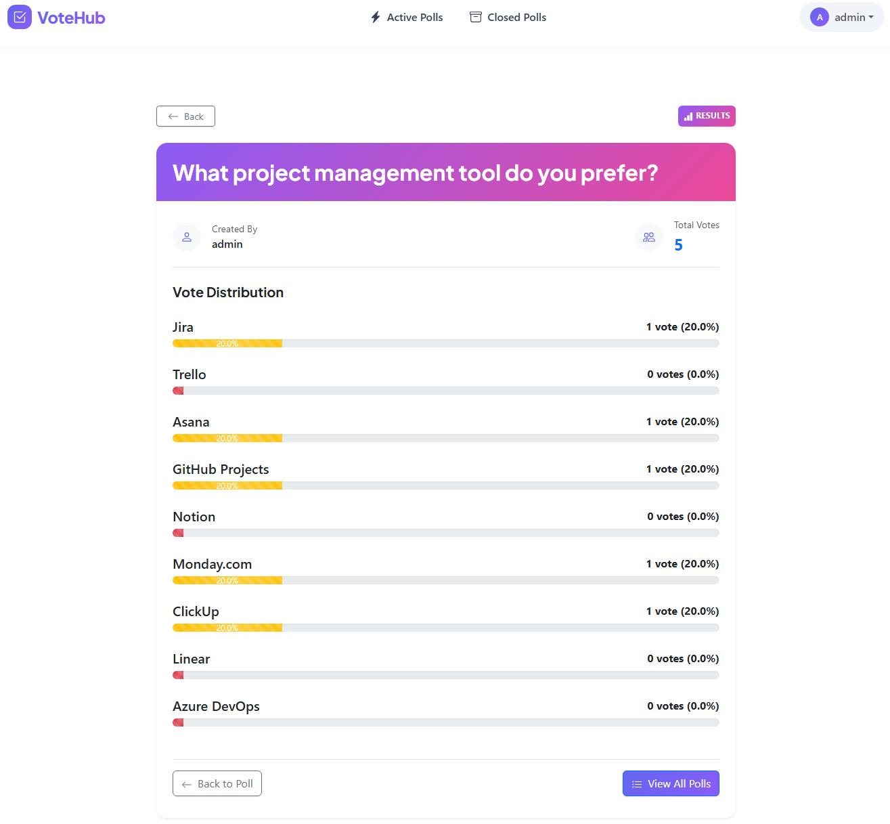
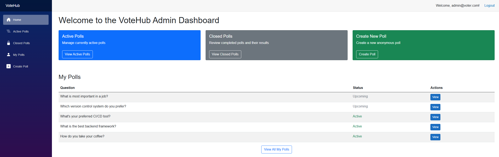

# 🗳️ VoteHub - Polling and Voting System

A comprehensive polling and voting system built with modern web technologies as a university project. The application provides a complete solution for creating, managing, and participating in polls with multiple client interfaces and robust backend architecture.

## 🚀 Features

### User Features

- **Authentication & Authorization**: Complete user registration and login system with JWT token-based authentication
- **Poll Management**: Create, view, and manage polls with multiple options
- **Active Polls**: Browse and participate in currently active polls
- **Closed Polls**: View results and historical data of completed polls
- **User Dashboard**: Personal poll management and voting history
- **Real-time Updates**: Live poll results and status updates

### Technical Features

- **Multi-Client Architecture**: Two independent frontend applications (React and Blazor WebAssembly)
- **RESTful API**: Comprehensive Web API with proper HTTP status codes and response handling
- **Data Persistence**: Entity Framework Core with database migrations
- **Comprehensive Testing**: Unit tests, integration tests, and component tests
- **Layered Architecture**: Clean separation of concerns with DataAccess and WebAPI layers
- **Authentication**: ASP.NET Core Identity with JWT bearer tokens
- **Auto-mapping**: AutoMapper for DTO transformations

## 💻 Technologies

### Backend

- **ASP.NET Core Web API** - RESTful API development
- **Entity Framework Core** - Data access and ORM
- **ASP.NET Core Identity** - User management and authentication
- **JWT Bearer Authentication** - Secure token-based authentication
- **AutoMapper** - Object-to-object mapping

### Frontend - React

- **React 19 with TypeScript**
- **React Router DOM** - Client-side routing
- **Bootstrap 5** - UI components and styling
- **Formik & Yup** - Form handling and validation
- **Vite** - Build tool and development server

### Frontend - Blazor

- **Blazor WebAssembly** - Client-side .NET framework
- **Blazored.LocalStorage** - Browser storage management
- **Bootstrap** - Responsive UI components

### Testing

- **xUnit** - Unit and integration testing framework
- **Moq** - Mocking framework for unit tests
- **bUnit** - Blazor component testing
- **Microsoft.AspNetCore.Mvc.Testing** - Integration testing

### Development Tools

- **ESLint** - Code linting for TypeScript/JavaScript
- **TypeScript** - Type-safe JavaScript development
- **ELTE.FI.SARuleSet** - Code analysis rules

## 🏗️ Architecture

### Backend Structure

```
├── Voter.DataAccess/     # Data access layer with Entity Framework
├── Voter.WebAPI/         # REST API controllers and middleware
├── Voter.Shared/         # Shared models and DTOs
└── Voter.Tests/          # Comprehensive test suite
```

### Frontend Structure

```
├── voter.react/                    # React TypeScript client
└── Voter.Blazor.WebAssembly/       # Blazor WebAssembly client
```

## 🔐 Security Features

- **JWT Authentication**: Secure token-based authentication
- **Authorization Attributes**: Role-based access control
- **Automatic Token Handling**: Client-side token management with automatic logout on expiration
- **Input Validation**: Model validation on both client and server side

## 📸 Screenshots



 



## 📋 Project Details

- **University**: ELTE
- **Course**: Modern Web Technologies (.NET)
- **Year**: 2025

## ⭐ This project demonstrates full-stack web development skills with modern .NET technologies, comprehensive testing practices, and multiple client implementations. This project is not actively maintained.
